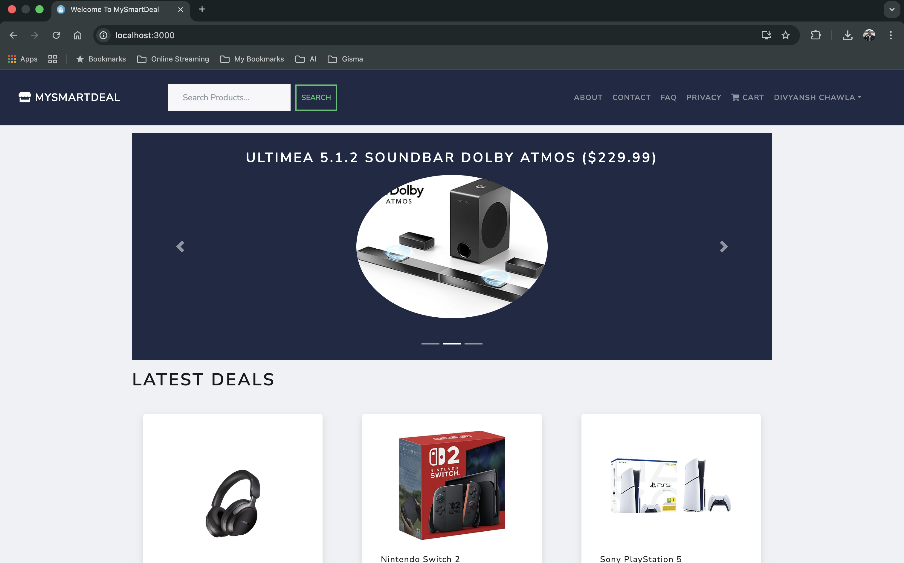
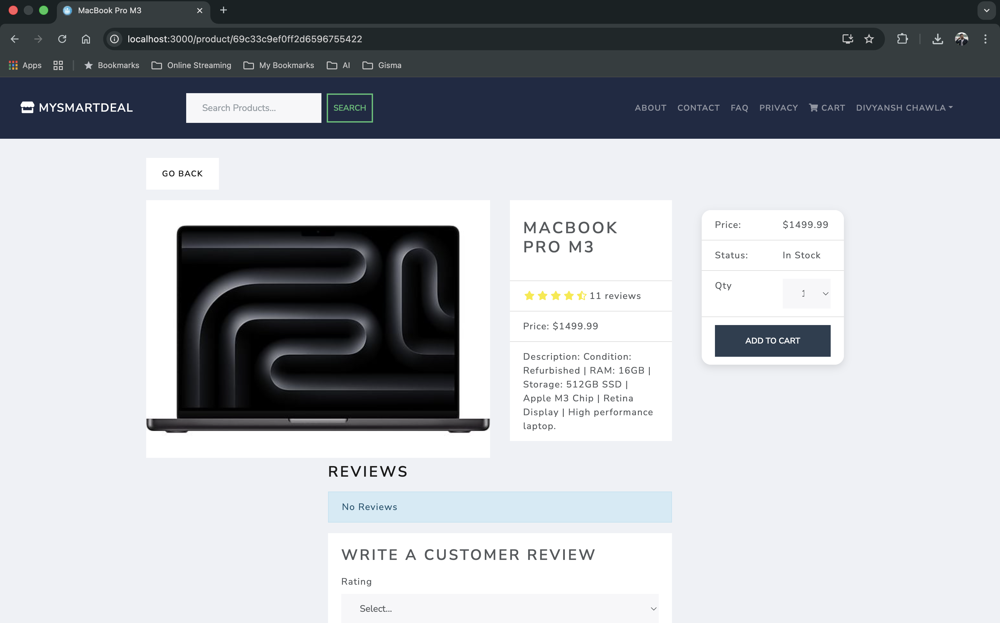
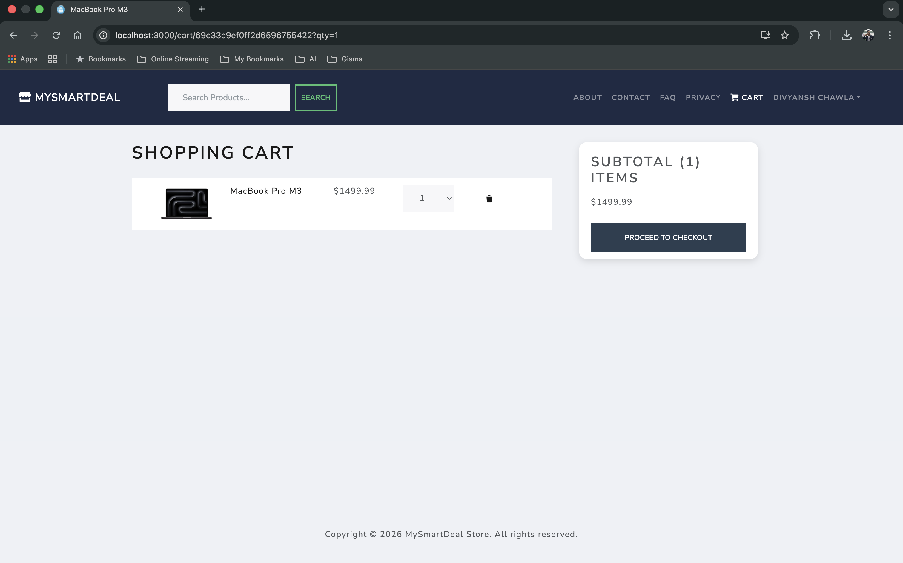
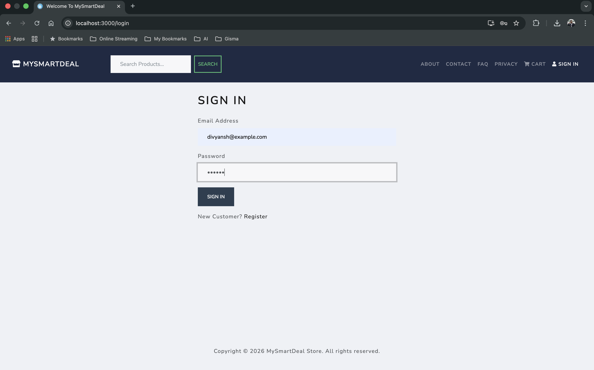
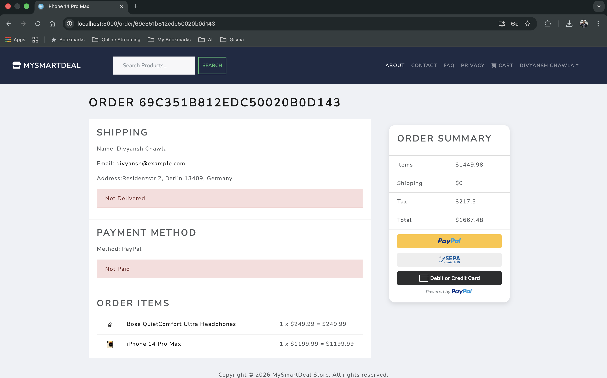
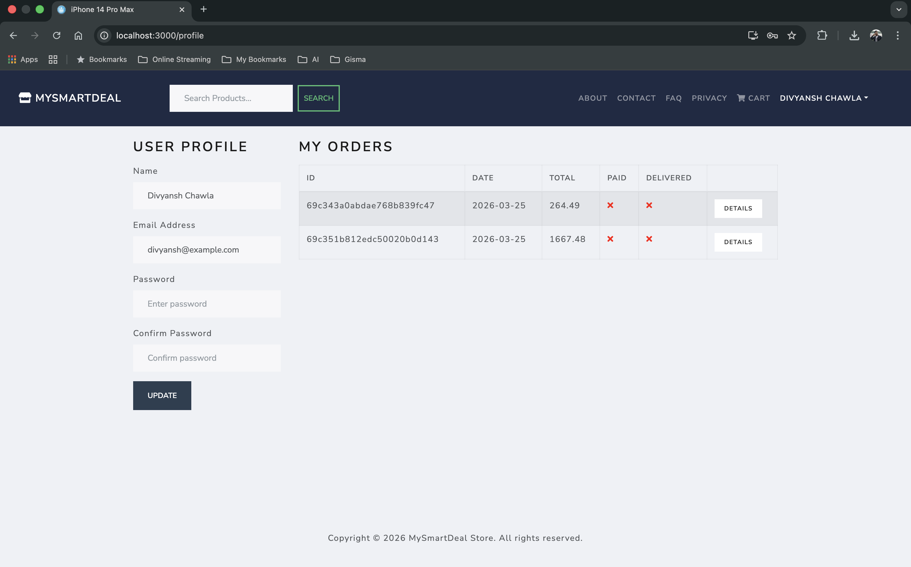
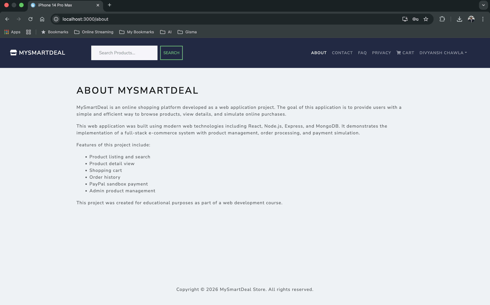

# MySmartDeal 🛒 – Full Stack E-Commerce Web Application

**Student Name:** Divyansh Chawla  
**Student ID:** GH1031116  
**Course:** App and Web Development   
**GitHub Repository:** https://github.com/divyanshchawlaa/mysmartdeal 

## 1. Introduction

This project presents the design and implementation of a full-stack e-commerce web application called **MySmartDeal**.  
The goal of the project is to create a functional online shopping platform that demonstrates the integration of front-end, back-end, database, and payment systems using modern web technologies.

The application allows users to browse products, search items, view product details, add items to the cart, simulate payments using PayPal sandbox, and view order history.  
In addition, an admin user can manage products and orders.

The system was developed using the following technologies:

- React.js for frontend
- Node.js and Express.js for backend
- MongoDB Atlas for database
- PayPal Sandbox for payment simulation
- Docker for containerization
- GitHub for version control

This project demonstrates the complete development cycle of a web application including design, implementation, testing, and deployment.

---

## 2. Project Planning and Design

Before implementation, the project structure was planned to follow a standard full-stack architecture with separate frontend and backend modules.

The application was divided into:

- Frontend (React UI)
- Backend (Express API)
- Database (MongoDB)
- Payment service (PayPal sandbox)
- Deployment (Docker)

The architecture follows a REST-based client-server model where the frontend communicates with the backend through API requests.

---

## 3. Project Structure

MySmartDeal/    
│   
├── backend/    
│ ├── config/   
│ ├── controllers/   
│ ├── models/   
│ ├── routes/   
│ ├── middleware/   
│ ├── data/   
│ ├── server.js   
│ └── seeder.js   
│   
├── frontend/   
│ ├── public/   
│ ├── src/    
│ │ ├── components/   
│ │ ├── screens/    
│ │ ├── actions/    
│ │ ├── reducers/   
│ │ ├── store.js    
│ │ └── App.js    
│   
├── Dockerfile    
├── .dockerignore   
├── package.json    
├── config.env    
└── README.md   

The backend handles API logic while the frontend manages the user interface.

---

## 4. Frontend Implementation

The frontend was developed using React and Bootstrap.

Main features:

- Responsive navigation bar
- Product listing page
- Product details page
- Search functionality
- Cart system
- Login / Register
- Profile page
- Order history page
- Company information pages (About, Contact, FAQ, Privacy)

Technologies used:

- React
- React Router
- Redux
- Bootstrap
- Axios

The UI was customized with additional styling, card layout improvements, and navigation bar modifications to create a unique design.

---

## 5. Backend Implementation

The backend server was built using Node.js and Express.js.

Responsibilities:

- Handle HTTP requests
- Manage authentication
- Connect to MongoDB
- Process orders
- Provide PayPal configuration

Important files:

- server.js – main server
- controllers – business logic
- routes – API endpoints
- models – database schema
- middleware – authentication & errors

The server runs on port 5001.

---

## 6. Database Schema

MongoDB Atlas was used as the database.  
Mongoose was used to define schemas.

### 6.1 User Schema

Fields:

- name
- email
- password
- isAdmin

Users can log in, create orders, and view order history.

### 6.2 Product Schema

Fields:

- name
- price
- image
- brand
- category
- description
- countInStock
- rating
- numReviews

Products are stored in the product collection and displayed on the homepage.

### 6.3 Order Schema

Fields:

- user
- orderItems
- shippingAddress
- paymentMethod
- totalPrice
- isPaid
- isDelivered
- createdAt

Relationships:

- One user → many orders
- One order → many products

This structure allows efficient data storage.

---

## 7. API Endpoints

The backend uses RESTful APIs.

### Product API

GET /api/products  
GET /api/products/:id  
POST /api/products  
PUT /api/products/:id  
DELETE /api/products/:id  

### User API

POST /api/users/login  
POST /api/users  
GET /api/users/profile  
PUT /api/users/profile  
GET /api/users  

### Order API

POST /api/orders  
GET /api/orders/:id  
GET /api/orders/myorders  
PUT /api/orders/:id/pay  
GET /api/orders  

### PayPal API

GET /api/config/paypal

These endpoints allow communication between frontend and backend.

---

## 8. Purchasing Process

The purchasing process simulates a real online shop.

Steps:

1. User selects a product
2. Product added to cart
3. User logs in
4. Shipping address entered
5. Payment method selected
6. PayPal sandbox used
7. Order created
8. Order stored in database
9. Order shown in history

This ensures the full workflow of an e-commerce system.

---

## 9. Payment Integration

PayPal sandbox was used to simulate payments.

Environment variable:

PAYPAL_CLIENT_ID=sb

The PayPal button appears on the payment page and allows test transactions.

No real money is used.

---

## 10. Docker Setup

The project was containerized using Docker.

Dockerfile was created in the root directory.

Build container:

docker build -t mysmartdeal .

Run container:

docker run -p 5001:5001 mysmartdeal

Docker ensures the project runs in the same environment on any system.

---

## 11. Setup Instructions

1. Install Node.js
2. Install MongoDB Atlas
3. Clone repository

git clone https://github.com/divyanshchawlaa/mysmartdeal

Install dependencies:

npm install
cd frontend
npm install

Run backend:

npm run server

Run frontend:

npm start

Open browser:

http://localhost:3000

---

## 12. GitHub Repository

Project source code:

https://github.com/divyanshchawlaa/mysmartdeal

The repository includes frontend, backend, and Docker files.

---

## 13. Testing

The application was tested by:

- Creating users
- Adding products
- Making orders
- Testing PayPal
- Checking order history
- Testing admin functions

All features worked correctly.

---

## 14. Conclusion

This project demonstrates the development of a complete full-stack e-commerce web application.

The system includes:

- Frontend UI
- Backend API
- Database integration
- Payment simulation
- Docker container

The project fulfills all requirements of the assignment and demonstrates practical knowledge of web development.

## 15. Screenshots

### Home Page

The home page shows the navigation bar, product carousel, and product list.

---

### Product Details

The product page displays detailed information about the selected item.

---

### Cart Page

The cart page shows selected products before checkout.

---

### Login Page

Users can log in to access orders and profile.

---

### Payment Page

PayPal sandbox is used to simulate payment.

---

### Order History

Users can view previous orders.

---

### About Page

Company information page added for the project.
report update
report
